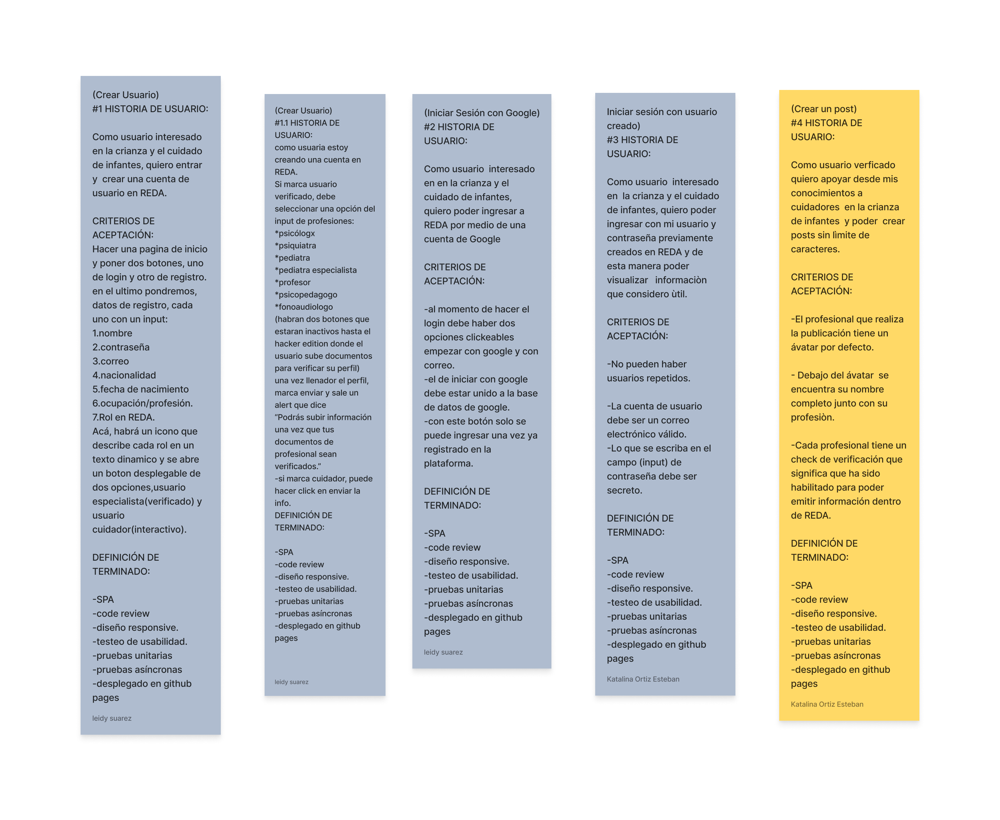
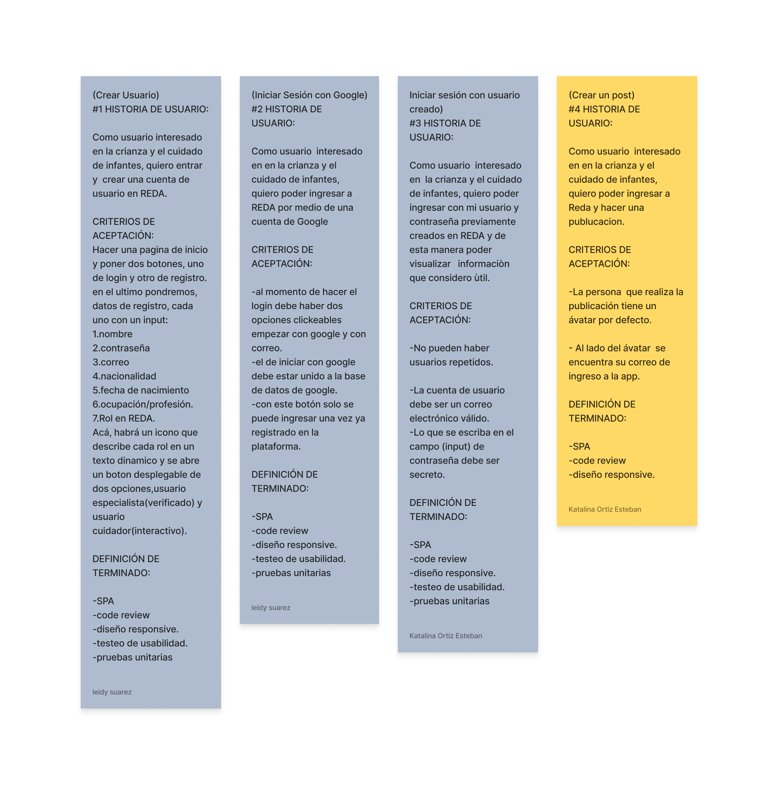
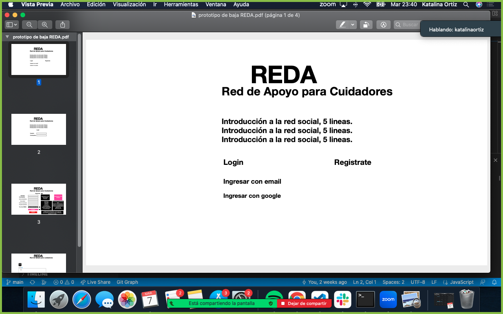
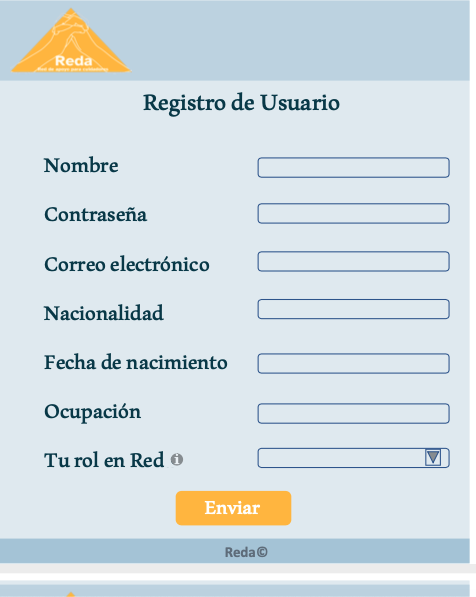

# REDA (Red de Apoyo para Cuidadores)

## Índice

* [1. Preámbulo: introducción a la app](#1-Preámbulo:-introducción-a-la-app)
* [2. ¿Qué es REDA?, resumen del proyecto.](#2-¿Qué-es-REDA?,-resumen-del-proyecto)
* [3. Características generales de la aplicación:](#5-criterios-de-aceptación-mínimos-del-proyecto)
* [4. Definición del producto ](#4-Definición-del-producto)
* [5. Historias de usuario ](#5-Historias-de-usuario)
* [6. Diseño de la Interfaz de Usuario (prototipo de baja fidelidad)](#6-Diseño-de-la-Interfaz-de-Usuario-(prototipo-de-baja-fidelidad))
* [7. Diseño de la Interfaz de Usuario (prototipo de alta fidelidad)](#7-Diseño-de-la-Interfaz-de-Usuario-(prototipo-de-alta-fidelidad))
* [8. Diseño responsivo de la interfaz de usuario.](#8-Diseño-responsivo-de-la-interfaz-de-usuario.)

## 1. Preámbulo: introducción a la app

Buscamos diseñar una red social inclusiva, dedicada a la interacción entre, por un lado:
a). Personas que tengan menores de edad bajo su cuidado, y por el otro:
b). profesionistas dedicadxs al cuidado infantil.

Es por ello que, desde el titulo de la app, optamos por utilizar la palabra "cuidador", 
en vez de "padres" o "madres", buscando enfatizar que en la app es un espacio que busca destacar
la diversidad de personas quese dedican al cuidado infantil: (padrxs, madrxs, abuelxs, profesorxs, niñerxs, etc.) 
sin dar por sentado que algún rol es mas relevante que otro, ya que cada contexto de crianza
es particular.

## 2. ¿Qué es REDA?, resumen del proyecto.

La particularidad de nuestra red social, es que los usuarios pueden tener dos roles: 
a). Experto.  y 
b). Cuidador.

Los usuarios que pueden registrarse como a). "experto" en la app, es porque cuentan con algún titulo universitario,
certificación o especialidad que respalda la veracidad de su conocimiento, y por ende de sus publicaciones. 

Los usuarios con el rol de b). "cuidador" pueden dar like a las publicaciones, y hacer comentarios sobre ellas.
Pero no pueden hacer publicaciones. 

El objetivo de lo anterior, es que REDA se constituya como un espacio seguro, donde los cuidadores puedan informarse 
sobre temas de interés de la mano de expertos, asegurándose de que la información que estan consumiendo tiene algun tipo
de respaldo profesional.

## 3. Características generales de la aplicación:

* Es un SPA.
* Cada vista cuenta con un diseño responsivo.
* Cuenta con la implementación de un router para la navegación entre las diferentes vistas de la app.
* Emplea un servicio externo (firebase y firestore) para el manejo y la persistencia de la información. 
* Cuenta con una suite de pruebas unitarias asíncronas. 

### Invenstigación.
A partir de una brevísima explioración con usuarios potenciales de la app:(1 padre de familia biparental,
1 madre de familia monoparental, y un psicógo experto en la crianza), identificamos que la principal preocupación de 
los tres usuarios es la dificultad para verificar si la fuente de información que estan consumiendo es 
veridica y confiable, o si tiene algún sustento cientifico.

A partir de lo anterior, decidimos que REDA tendria que funcionar como un espacio que responda dicha necesidad:
es por esa razón que unicamente pueden publicar las personas con licencias adecuadas. 
### REDA link:
Reda esta disponible en el siguiente enlace:
https://dev-004-social-network-5lb7w0w97-chuzalvaca.vercel.app/
 
 ### 4 Definición del producto 

  La aplicacion REDA espera acompañar a quienes que estan pasando por el proceso de crianza, acogiendo a cualquier persona que cumpla esa labor y que en la red le llamamos cuidador. Y por otra parte, apuntamos a que estas personas encuentren la información necesaria y correcta, segun los objetivos educativos que cada familia tenga, y con eso sumamos a los profesionales de Educacion, Psicologia, Fonoaudiologia y Pediatria, los que cumplen un rol de especialista, que quieran aportar desde su conocimiento y experienci, apoyando en conjunto a crear una red  eficiente y acogedora, que no juzgue y eseñe a todos quienes quieran salir de los patrones normativos de eseñanza. 

### 5 Historias de usuario 

  Para poder programar el proyecto, lo planteamos en 10 historias de usuario, donde explicabamos cada paso de formacion en la red solcial.
  
  
  Con el avance del tiempo, hicimos alguna modificaciones que quedan expresadas en las siguientes imagenes con las historias de usuarias modificadas según avanzamos el proyecto.
  
  

### 6 Diseño de la Interfaz de Usuario (prototipo de baja fidelidad) 

  En las siguientes imagenes, se pueden apreciar los prototipos de baja, solo en blanco y negro, y con algunas aplicaciones de color para expresar los distintos tipos de usuario.
  
  
  
  
  

### 7 Diseño de la Interfaz de Usuario (prototipo de alta fidelidad) 

  En esta seccion se pueden ver los prototipos de alta, en donde ya se pueden apreciar la paleta de colores que elegimos, con los botones según esperabamos que se viera la plataforma al finalizar.(Este no fue el diseño que finalmente elegimos, respetamos los colores base pero cambiamos algunos iconos y botones, que podran apreciar en la pagina final que se entrego.)

  
  
  
  
  
### 8 Diseño responsivo de la interfaz de usuario.

  En este espacio se veran las imagenes de la plataforma responsiva en un media query de 390 px.

  
  
  
  
  

#### Creación de cuenta de usuario e inicio de sesión lady
En el presente proyecto se implementò  Firebase, la plataforma en la nube para el desarrollo de aplicaciones web y móvil de Google. Firebase proporciona servicios de backend, SDK fáciles de usar y bibliotecas de interfaz  las cuales  posibilitan la autenticaciòn de los usuarios y el almacenamiento de las publicaciones que estos deseen crear.
Con base a lo anterior, el proyecto REDA posibilita lo siguiente:

* Creaciòn de cuenta e inicio de sesiòn:
- Crear una cuenta de acceso y autenticación con cuenta de correo y contraseña.
- Iniciar sesiòn con la cuenta anteriormente creada.
- Iniciar sesiòn con una cuenta de Google.
 
 Las anteriores funcionalidades cumplen una serie de requisitos (validaciones) y comportamientos escenciales para su correcto funcionamiento.

* Validaciones:
  - Si la cuenta no es vàlida, el usuario no puede inciar sesiòn.
  - No pueden haber usuarios repetidos.
  - La cuenta de usuario debe ser un correo electrónico válido.
  - Lo que se escriba en el campo  de contraseña debe ser secreto.

* Comportamiento:
  - Antes de que el usuario envìe el formulario de registro o inicio de sesión se valida que los campos no esten vacìos.
  - Cuando hay errores se  muestra una serie de mensajes descriptivos que ayuda all usuario a corregirlos.

#### Muro/timeline lady
 Antes de que el usuario publique contenido de su interès; REDA se encarga de realizar las repectivas validaciones garantizando un adecuado funcionamiento, las cuales se basan en la validaciòn de usuarios y el comportamiento de la interfaz.

* Validaciones:
  - Al publicar, Reda valida que exista contenido en la caja de texto.
* Comportamiento:
  Es necesario que el usuario haya iniciado sesiòn antes poder relaizar las siguientes actividades:

  - Ver las publiaciones propias y de otros usuarios.
  - Poder publicar un post.
  - Poder dar y quitar like a una publicación. 
   Cabe aclarar que el usuario solo puede dar like una vez y en la interfaz se visualiza la cantidad de 
  likes que tienen los post.

   - El usuario solo puede  eliminar sus propios posts, no las publiaciones pertenecientes a otros 
     usuarios.
   Se le muestra al usuario una ventana que le pide confirmar antes de elimianr cualquier publicaciòn.
  - El usuario solo puede editar sus propias publicaciones.
  Cuando el usuario modifica un escrito, èste se actualiza y le  permite guardar y publicar los nuevos 
  cambios.
  -
   
  

### 5.7 Consideraciones técnicas Front-end lady

En el presente proyecto se separò las responsabilidades permtiendo un funcionamiento sencillo y eficaz.
Es por esto que se crèo un archivo Java Script por cada una de las vistas:
- Home: Pàgina de inicio la cual muestra la opciòn de inciar sesiòn o registrarse.
- Register: Pàgina que le indica al usuario la informaciòn que debe digitar para regsistrarse.
- Login : Vista que le posibilita al usuario anteriormente registrado iniciar sesiòn o para lo no registrados existe la opciòn de ingresar con uan cuenta de Google.
- Feed: Implementaciòn de las funciones importadas del archivo Firebase.js que permitieron la funcionalidades de REDA anteriormente descritas.
- Firebase.js: En este documento se crearon todas las funciones que permiten crear, visualizar, editar, likear, deslikear y eliminar un post.
- Autenticaciòn: En este apartado se crearon las funciones que le permiten al usuario registarse e inciar sesiòn.
- Router: en este archivo se crea por un lado la funciòn que permite navegar por los diferentes archivos, y por el otro la funciòn que permite identificar què usuario se encuentra logueado.
- Routes:  En este documento se crean las rutas de las vistas del proyecto.
- Main: En este archivo se inicializan las rutas.
- Styles: En este documento se configura la parte estètica de todas las vistas.

Con el objetivo de garantizar la velocidad de la pàgina se implemento una Single-page application, es decir, un sitio web que cabe en una sola página con el propósito de dar una experiencia más fluida a los usuarios, como si fuera una aplicación de escritorio.

#### Pruebas unitarias (unit tests) lady 
Con el objetivo de garantizar la calidad del còdigo implementado se relizaron 11 test a las funciones implementadas haciendo uso de Jest. Cabe destacar que el proyecto cumple con una covertura total de 96.8% de 100% porcentaje considerado alto.

### 5.8 Consideraciones técnicas UX

* Hacer al menos 2 entrevistas con usuarios.
* Hacer un  prototipo de baja y alta fidelidad.
* Asegurarte de que la implementación en código siga los lineamientos del
  diseño.
* Hacer sesiones de _testing de usabilidad_ con el producto en HTML.

