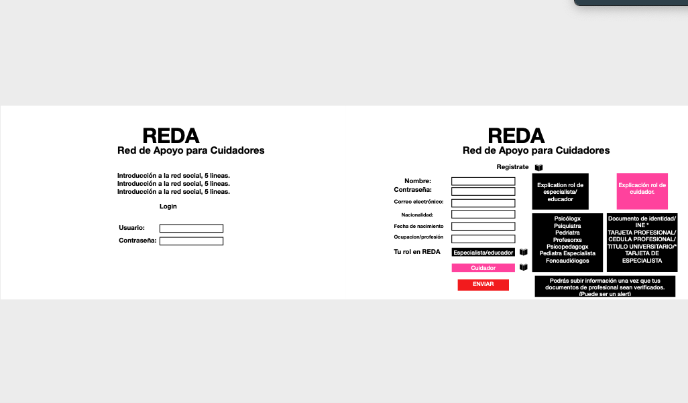
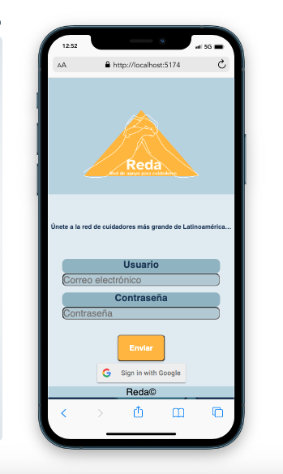
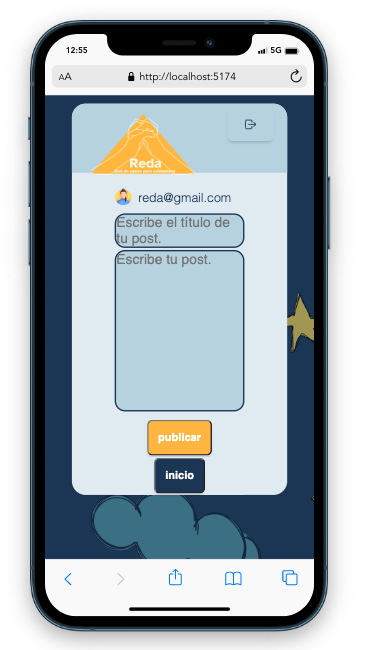
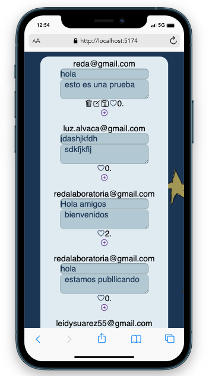

# REDA (Red de Apoyo para Cuidadores)

## Índice

* [1. Preámbulo: introducción a la app](#1-Preámbulo:-introducción-a-la-app)
* [2. ¿Qué es REDA?, resumen del proyecto.](#2-¿Qué-es-REDA?,-resumen-del-proyecto)
* [3. Características generales de la aplicación:](#5-criterios-de-aceptación-mínimos-del-proyecto)

## 1. Preámbulo: introducción a la app

Buscamos diseñar una red social inclusiva, dedicada a la interacción entre, por un lado:
a). Personas que tengan menores de edad bajo su cuidado, y por el otro:
b). profesionistas dedicadxs al cuidado infantil.

Es por ello que, desde el titulo de la app, optamos por utilizar la palabra "cuidador", 
en vez de "padres" o "madres", buscando enfatizar que en la app es un espacio que busca destacar
la diversidad de personas quese dedican al cuidado infantil: (padrxs, madrxs, abuelxs, profesorxs, niñerxs, etc.) 
sin dar por sentado que algún rol es mas relevante que otro, ya que cada contexto de crianza
es particular.

## 2. ¿Qué es REDA?, resumen del proyecto.

La particularidad de nuestra red social, es que los usuarios pueden tener dos roles: 
a). Experto.  y 
b). Cuidador.

Los usuarios que pueden registrarse como a). "experto" en la app, es porque cuentan con algún titulo universitario,
certificación o especialidad que respalda la veracidad de su conocimiento, y por ende de sus publicaciones. 

Los usuarios con el rol de b). "cuidador" pueden dar like a las publicaciones, y hacer comentarios sobre ellas.
Pero no pueden hacer publicaciones. 

El objetivo de lo anterior, es que REDA se constituya como un espacio seguro, donde los cuidadores puedan informarse 
sobre temas de interés de la mano de expertos, asegurándose de que la información que estan consumiendo tiene algun tipo
de respaldo profesional.

## 3. Características generales de la aplicación:

* Es un SPA.
* Cada vista cuenta con un diseño responsivo.
* Cuenta con la implementación de un router para la navegación entre las diferentes vistas de la app.
* Emplea un servicio externo (firebase y firestore) para el manejo y la persistencia de la información. 
* Cuenta con una suite de pruebas unitarias asíncronas. 

### Invenstigación.
A partir de una brevísima explioración con usuarios potenciales de la app:(1 padre de familia biparental,
1 madre de familia monoparental, y un psicógo experto en la crianza), identificamos que la principal preocupación de 
los tres usuarios es la dificultad para verificar si la fuente de información que estan consumiendo es 
veridica y confiable, o si tiene algún sustento cientifico.

A partir de lo anterior, decidimos que REDA tendria que funcionar como un espacio que responda dicha necesidad:
es por esa razón que unicamente pueden publicar las personas con licencias adecuadas. 
### REDA link:
Reda esta disponible en el siguiente enlace:
https://dev-004-social-network-5lb7w0w97-chuzalvaca.vercel.app/
 
 ### 5.2 Definición del producto 

  La aplicacion REDA espera acompañar a quienes que estan pasando por el proceso de crianza, acogiendo a cualquier persona que cumpla esa labor y que en la red le llamamos cuidador. Y por otra parte, apuntamos a que estas personas encuentren la información necesaria y correcta, segun los objetivos educativos que cada familia tenga, y con eso sumamos a los profesionales de Educacion, Psicologia, Fonoaudiologia y Pediatria, los que cumplen un rol de especialista, que quieran aportar desde su conocimiento y experienci, apoyando en conjunto a crear una red  eficiente y acogedora, que no juzgue y eseñe a todos quienes quieran salir de los patrones normativos de eseñanza. 

### 5.3 Historias de usuario 

  Para poder programar el proyecto, lo planteamos en 10 historias de usuario, donde explicabamos cada paso de formacion en la red solcial.
  
  
  Con el avance del tiempo, hicimos alguna modificaciones que quedan expresadas en las siguientes imagenes con las historias de usuarias modificadas según avanzamos el proyecto.
  
  

### 5.4 Diseño de la Interfaz de Usuario (prototipo de baja fidelidad) 

  En las siguientes imagenes, se pueden apreciar los prototipos de baja, solo en blanco y negro, y con algunas aplicaciones de color para expresar los distintos tipos de usuario.
  
  
  
  
  

### 5.5 Diseño de la Interfaz de Usuario (prototipo de alta fidelidad) 

  En esta seccion se pueden ver los prototipos de alta, en donde ya se pueden apreciar la paleta de colores que elegimos, con los botones según esperabamos que se viera la plataforma al finalizar.(Este no fue el diseño que finalmente elegimos, respetamos los colores base pero cambiamos algunos iconos y botones, que podran apreciar en la pagina final que se entrego.)

  
  
  
  
  
### 5.6 Diseño responsivo de la interfaz de usuario.

  En este espacio se veran las imagenes de la plataforma responsiva en un media query de 390 px.

  
  
  
  
  

#### Creación de cuenta de usuario e inicio de sesión lady

* _Login_ con Firebase:
  - Para el _login_ y las publicaciones en el muro puedes utilizar [Firebase](https://firebase.google.com/products/database/)
  - Creación de cuenta de acceso y autenticación con cuenta de correo y
    contraseña, y también con una cuenta de Google.
* Validaciones:
  - Solamente se permite el acceso a usuarios con cuentas válidas.
  - No pueden haber usuarios repetidos.
  - La cuenta de usuario debe ser un correo electrónico válido.
  - Lo que se escriba en el campo (_input_) de contraseña debe ser secreto.
* Comportamiento:
  - Al enviarse el formulario de registro o inicio de sesión, debe validarse.
  - Si hay errores, se deben mostrar mensajes descriptivos para ayudar al
  usuario a corregirlos.

#### Muro/timeline lady

* Validaciones:
  - Al publicar, se debe validar que exista contenido en el _input_.
* Comportamiento:
  - Al recargar la aplicación, se debe verificar si el usuario está _logueado_
    antes de mostrar contenido.
  - Poder publicar un _post_.
  - Poder dar y quitar _like_ a una publicación. Máximo uno por usuario.
  - Llevar un conteo de los _likes_.
  - Poder eliminar un post específico.
  - Pedir confirmación antes de eliminar un _post_.
  - Al dar _click_ para editar un _post_, debe cambiar el texto por un _input_
    que permita editar el texto y luego guardar los cambios.
  - Al guardar los cambios debe cambiar de vuelta a un texto normal pero con la
    información editada.
  - Al recargar la página debo de poder ver los textos editados.

### 5.7 Consideraciones técnicas Front-end lady

* Separar la manipulación del DOM de la lógica (Separación de responsabilidades).
* Contar con múltiples vistas. Para esto, tu aplicación debe ser una
 [Single Page Application (SPA)](https://es.wikipedia.org/wiki/Single-page_application)
* Alterar y persistir datos. Los datos que agregues o modifiques deberán
  persistir a lo largo de la aplicación. Te recomendamos que uses
  [Firebase](https://firebase.google.com/) para eso también.

#### Pruebas unitarias (unit tests) lady 

* Recuerda que no hay un _setup_ de **tests** definido, dependerá de
  la estructura de tu proyecto. Algo que no debes de olvidar es pensar en éstas
  pruebas, te pueden ayudar a definir la estructura y nomenclatura de tu lógica.

* Los tests unitarios deben cubrir un mínimo del 70% de _statements_, _functions_,
  _lines_, y _branches_.

### 5.8 Consideraciones técnicas UX

* Hacer al menos 2 entrevistas con usuarios.
* Hacer un  prototipo de baja y alta fidelidad.
* Asegurarte de que la implementación en código siga los lineamientos del
  diseño.
* Hacer sesiones de _testing de usabilidad_ con el producto en HTML.

