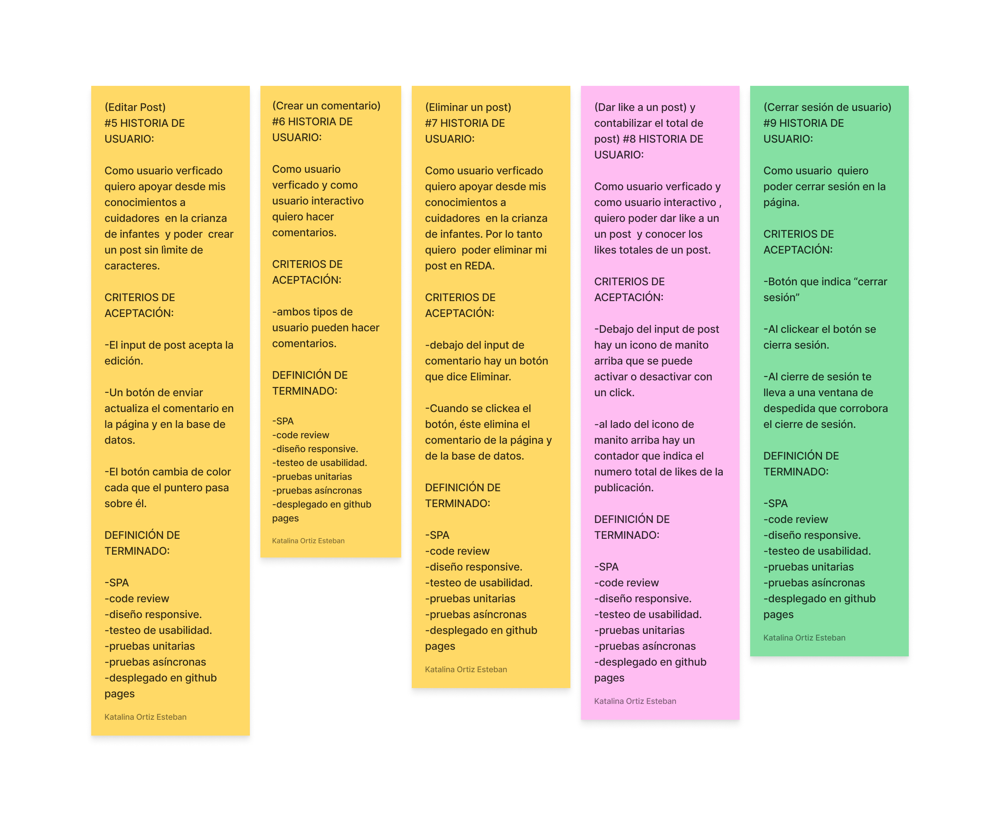
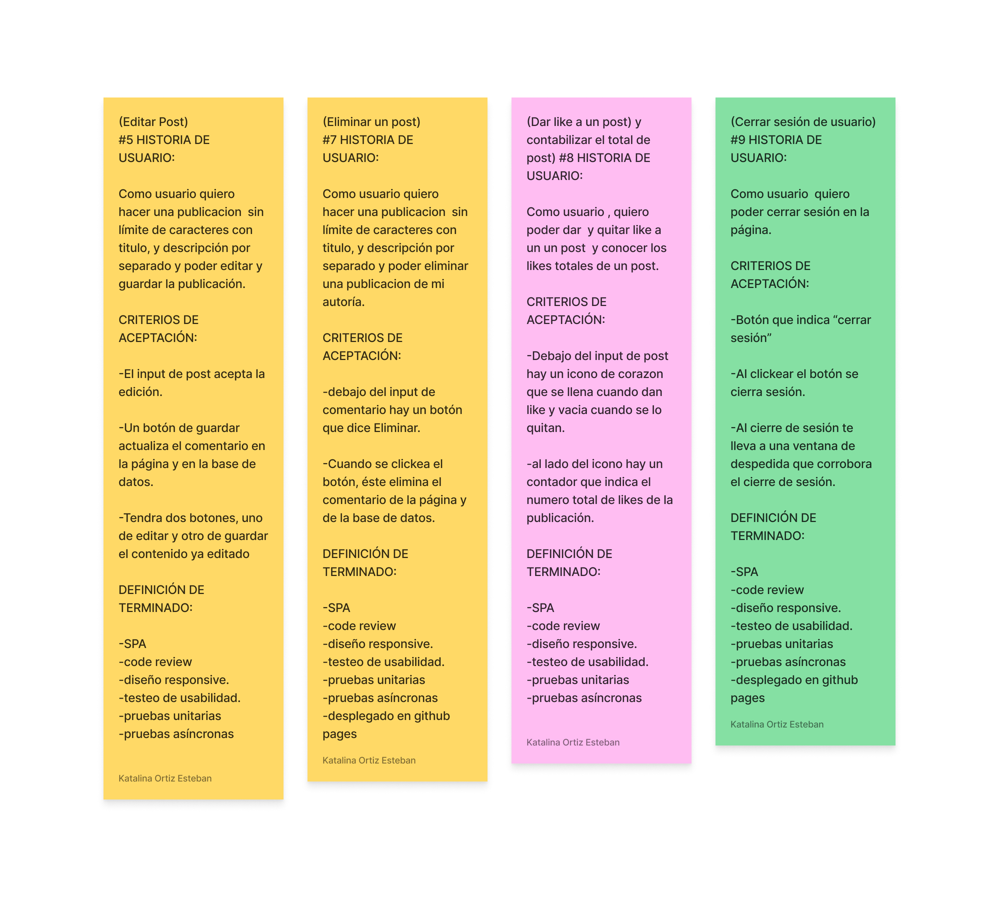
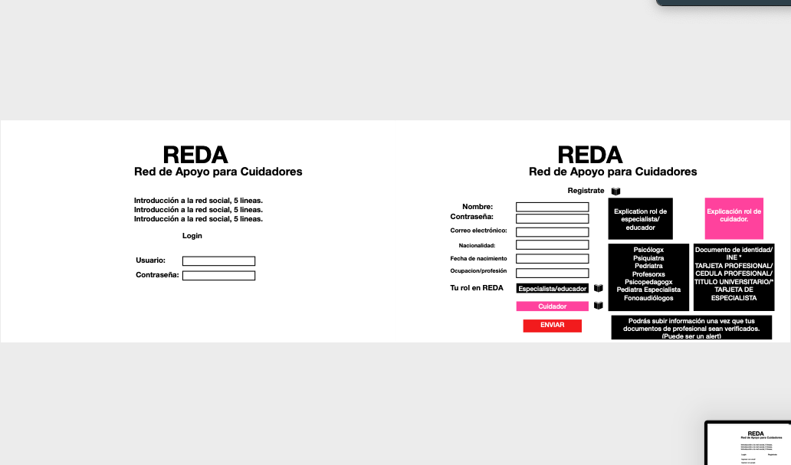
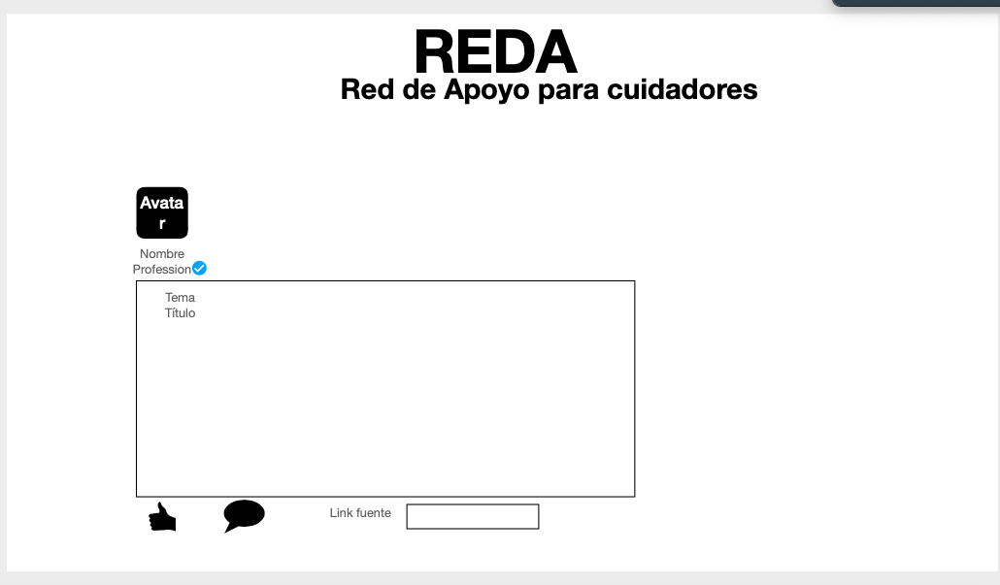
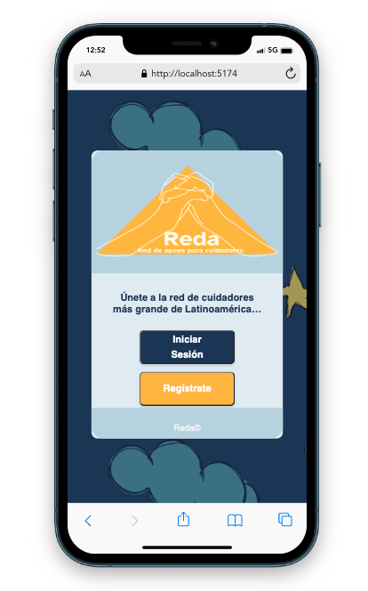

# Creando una Red Social

## Índice

poner el link del deploy
investigacion de usuario 

* [1. Preámbulo](#1-preámbulo)
* [2. Resumen del proyecto](#2-resumen-del-proyecto)

* [5. Criterios de aceptación mínimos del proyecto](#5-criterios-de-aceptación-mínimos-del-proyecto)

## 1. Preámbulo chuz

Instagram, Snapchat, Twitter, Facebook, Twitch, Linkedin, etc. Las redes
sociales han invadido nuestras vidas. Las amamos u odiamos, y muchos no podemos
vivir sin ellas.

Hay redes sociales de todo tipo y para todo tipo de intereses. Por ejemplo,
en una ronda de financiamiento con inversionistas, se presentó una red social
para químicos en la que los usuarios podían publicar artículos sobre sus
investigaciones, comentar en los artículos de sus colegas, y filtrar artículos
de acuerdo a determinadas etiquetas o su popularidad, lo más reciente, o lo
más comentado.

## 2. Resumen del proyecto chuz

En este proyecto construirás una Red Social sobre lo que decidan tú y tu equipo.
Podría ser, por ejemplo, sobre alimentación saludable, feminismo, educación,
salud, energías renovables, amantes de las [Empanadas](https://es.wikipedia.org/wiki/Empanada)
o de los [Tacos de Canasta](https://es.wikipedia.org/wiki/Taco),
de la [Feijoada](https://es.wikipedia.org/wiki/Feijoada), o de lo que sea.

Tu Red Social tendrá que permitir a cualquier usuario crear una cuenta de acceso
y loguearse con ella; crear, editar, borrar y _"likear"_ publicacciones.

Por lo tanto, en este proyecto construirás una
[Single-page Application (SPA)](https://es.wikipedia.org/wiki/Single-page_application)
[_responsive_](https://curriculum.laboratoria.la/es/topics/css/02-responsive) (con más de una vista / página)
en la que podamos **leer y escribir datos**.

### Los objetivos generales de este proyecto son los siguientes

* Desarrollar una SPA con temática de red social
* Aplicar los conceptos de responsividad en el desarrollo de las vistas (templates)
* Implementar un router para la navegación entre las diferentes vistas de la aplicación
* Emplear un servicio externo para la persistencia de datos de la aplicación
* Crear una suite de pruebas unitarias que permitan testear código asíncrono

Para lograr estos objetivos, deberás aprender y hacer uso de las siguientes
herramientas o habilidades técnicas:

## 5. Criterios de aceptación mínimos del proyecto

### 5.1 Boilerplate

Este proyecto no incluye un _boilerplate_ completo, solo algunos archivos de
configuración basico, así es que tendrás que definir la estructura de carpetas
y escribir tus propias Pruebas Unitarias (_tests_). Para hacerlo, puedes guiarte
de los proyectos anteriores y/o organizar los archivos siguiendo una estructura
de [Modelo-Vista-Controlador](https://developer.mozilla.org/es/docs/Glossary/MVC).

En este proyecto vamos a usar una herramienta llamada
[Vite](https://es.vitejs.dev/) para empaquetar nuestros módulos y arrancar
el servidor de desarrollo, el cual provee nuestros archivos utilizando
la estrategia `Hot Module Replacement`
[(HMR)](https://es.vitejs.dev/guide/features.html#hot-module-replacement),
esto significa que cuando hagas cambios en los archivos que estén siendo
servidos, el navegador automáticamente se actualizará sin tener que refrescar
y volver a cargar todo el sitio. Debes tener especial cuidado de no tener
ninguna _dependencia circular_ en tu código ya que
[eso puede ocasionar problemas con HMR](https://es.vitejs.dev/guide/troubleshooting.html#ocurre-un-refresco-completo-en-lugar-de-hmr).
(`eslint-plugin-import` tiene una regla
[import/no-cycle](https://github.com/import-js/eslint-plugin-import/blob/main/docs/rules/no-cycle.md)
que va a avisar si las tiene.)

### 5.2 Definición del producto 

  La aplicacion REDA espera acompañar a quienes que estan pasando por el proceso de crianza, acogiendo a cualquier persona que cumpla esa labor y que en la red le llamamos cuidador. Y por otra parte, apuntamos a que estas personas encuentren la información necesaria y correcta, segun los objetivos educativos que cada familia tenga, y con eso sumamos a los profesionales de Educacion, Psicologia, Fonoaudiologia y Pediatria, los que cumplen un rol de especialista, que quieran aportar desde su conocimiento y experienci, apoyando en conjunto a crear una red  eficiente y acogedora, que no juzgue y eseñe a todos quienes quieran salir de los patrones normativos de eseñanza. 

### 5.3 Historias de usuario 

  Para poder programar el proyecto, lo planteamos en 10 historias de usuario, donde explicabamos cada paso de formacion en la red solcial.
  
  
  Con el avance del tiempo, hicimos alguna modificaciones que quedan expresadas en las siguientes imagenes con las historias de usuarias modificadas según avanzamos el proyecto.
  
  

### 5.4 Diseño de la Interfaz de Usuario (prototipo de baja fidelidad) 

  En las siguientes imagenes, se pueden apreciar los prototipos de baja, solo en blanco y negro, y con algunas aplicaciones de color para expresar los distintos tipos de usuario.
  
  
  
  
  

### 5.5 Diseño de la Interfaz de Usuario (prototipo de alta fidelidad) 

  En esta seccion se pueden ver los prototipos de alta, en donde ya se pueden apreciar la paleta de colores que elegimos, con los botones según esperabamos que se viera la plataforma al finalizar.(Este no fue el diseño que finalmente elegimos, respetamos los colores base pero cambiamos algunos iconos y botones, que podran apreciar en la pagina final que se entrego.)

  
  
  
  
  
### 5.6 Diseño responsivo de la interfaz de usuario.

  En este espacio se veran las imagenes de la plataforma responsiva en un media query de 390 px.

  
  
  
  
  

#### Creación de cuenta de usuario e inicio de sesión lady

* _Login_ con Firebase:
  - Para el _login_ y las publicaciones en el muro puedes utilizar [Firebase](https://firebase.google.com/products/database/)
  - Creación de cuenta de acceso y autenticación con cuenta de correo y
    contraseña, y también con una cuenta de Google.
* Validaciones:
  - Solamente se permite el acceso a usuarios con cuentas válidas.
  - No pueden haber usuarios repetidos.
  - La cuenta de usuario debe ser un correo electrónico válido.
  - Lo que se escriba en el campo (_input_) de contraseña debe ser secreto.
* Comportamiento:
  - Al enviarse el formulario de registro o inicio de sesión, debe validarse.
  - Si hay errores, se deben mostrar mensajes descriptivos para ayudar al
  usuario a corregirlos.

#### Muro/timeline lady

* Validaciones:
  - Al publicar, se debe validar que exista contenido en el _input_.
* Comportamiento:
  - Al recargar la aplicación, se debe verificar si el usuario está _logueado_
    antes de mostrar contenido.
  - Poder publicar un _post_.
  - Poder dar y quitar _like_ a una publicación. Máximo uno por usuario.
  - Llevar un conteo de los _likes_.
  - Poder eliminar un post específico.
  - Pedir confirmación antes de eliminar un _post_.
  - Al dar _click_ para editar un _post_, debe cambiar el texto por un _input_
    que permita editar el texto y luego guardar los cambios.
  - Al guardar los cambios debe cambiar de vuelta a un texto normal pero con la
    información editada.
  - Al recargar la página debo de poder ver los textos editados.

### 5.7 Consideraciones técnicas Front-end lady

* Separar la manipulación del DOM de la lógica (Separación de responsabilidades).
* Contar con múltiples vistas. Para esto, tu aplicación debe ser una
 [Single Page Application (SPA)](https://es.wikipedia.org/wiki/Single-page_application)
* Alterar y persistir datos. Los datos que agregues o modifiques deberán
  persistir a lo largo de la aplicación. Te recomendamos que uses
  [Firebase](https://firebase.google.com/) para eso también.

#### Pruebas unitarias (unit tests) lady 

* Recuerda que no hay un _setup_ de **tests** definido, dependerá de
  la estructura de tu proyecto. Algo que no debes de olvidar es pensar en éstas
  pruebas, te pueden ayudar a definir la estructura y nomenclatura de tu lógica.

* Los tests unitarios deben cubrir un mínimo del 70% de _statements_, _functions_,
  _lines_, y _branches_.

### 5.8 Consideraciones técnicas UX

* Hacer al menos 2 entrevistas con usuarios.
* Hacer un  prototipo de baja y alta fidelidad.
* Asegurarte de que la implementación en código siga los lineamientos del
  diseño.
* Hacer sesiones de _testing de usabilidad_ con el producto en HTML.

